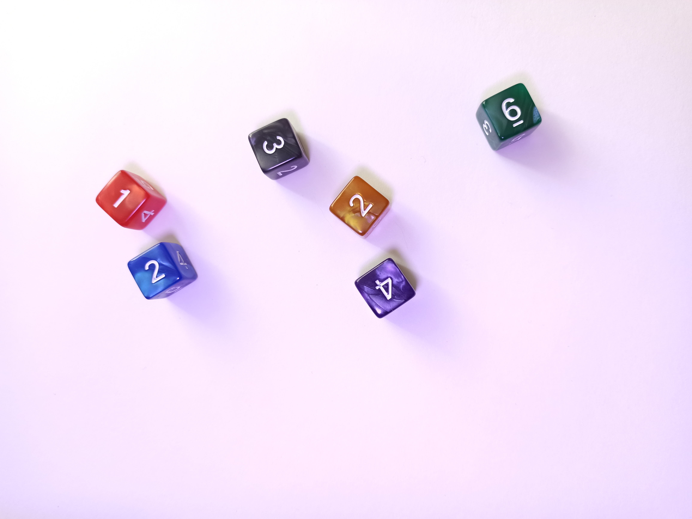
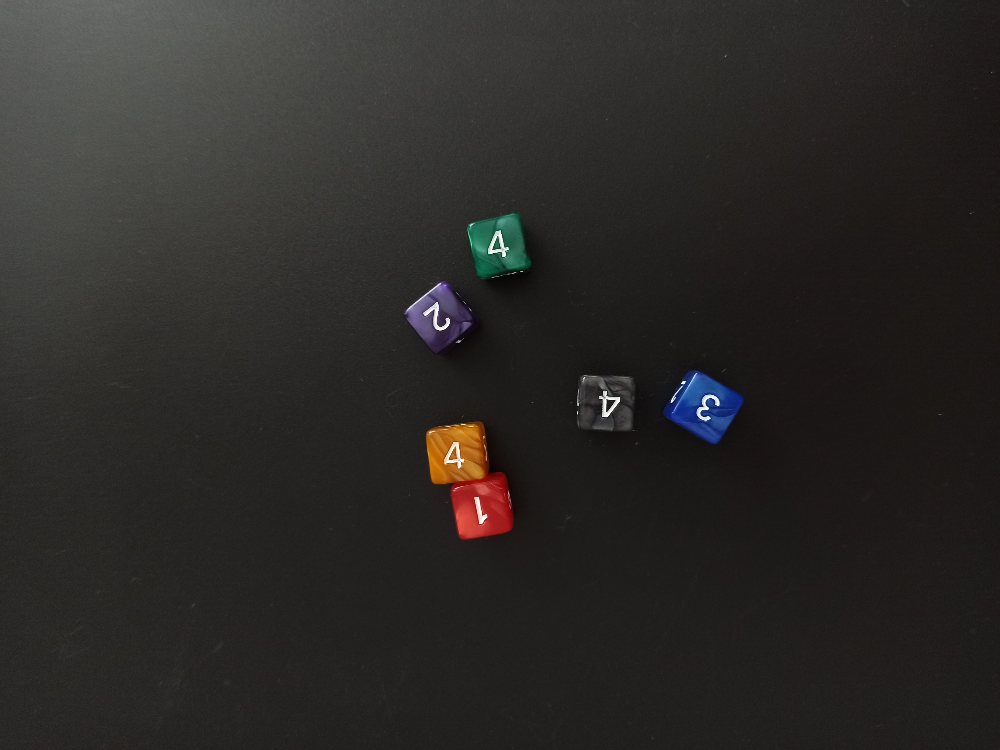

# Hackathon Report: Object Detection in Images
# Overview
The hackathon challenged participants to solve two object detection tasks on images without using machine learning models. The goal was to detect dice and compute the sum of their points or numbers using classical computer vision techniques.

Problem Description
Task 1: Basic Level
Objects: Black dice with white dots

Goal: Calculate the total sum of the dots on all dice in the image

Output: A single integer representing the sum

Example images:

   

Task 2: Advanced Level
Objects: Colored dice with printed numbers (uniform style)

Goal: Calculate the total sum of the numbers on all dice in the image

Output: A single integer representing the sum

Example images:

   

Data Details
Format: .jpg images

Resolution: 3472×4624 pixels

Background: Uniform light or black

Training Data: Provided in data_train/basic and data_train/advanced folders

Labels: Available as labels_basic.json and labels_advanced.json

Test Data: Not provided; evaluation will be on combined training and test sets

Rules and Constraints
✅ Allowed:

Any classical computer vision libraries (OpenCV, scikit-image, etc.)

Traditional image processing techniques (filters, thresholding, affine transformations)

❌ Prohibited:

Neural networks or any machine learning models (including pre-trained)

Hardcoded solutions tailored only to training data

Solution Requirements
Implement get_base_task_solution() and get_advanced_task_solution() in solution_pipeline.py.

Do not modify other parts of the file (e.g., argument parsing).

The solution will be tested by running:
python solution_pipeline.py --dir data

Expected output files:

base_predictions.csv

advanced_predictions.csv

Provide a well-structured Git repository including:

requirements.txt for dependencies

README.md describing your approach